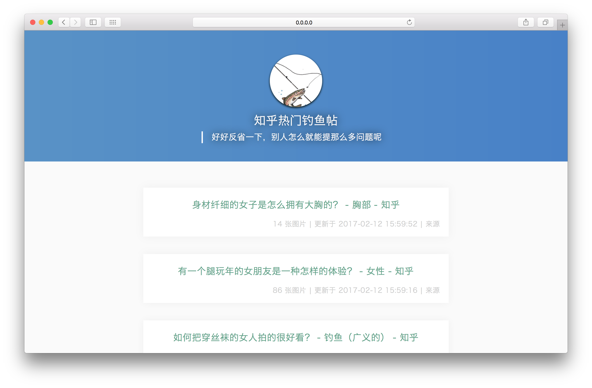

# [知乎热门钓鱼帖](http://fish.jifangcheng.com)

> ###**好好反省一下，别人怎么就能提那么多问题呢**

## 开发
### 前端
* `npm install` 安装依赖的库
* `npm run d` 启动开发环境
* `npm run build` 打包

### 后端
#### 使用 docker 🐳
* `pip install fabric` 安装 fabric
* `cp config/local_config.py.tpl config/local_config.py` 初始化数据库相关配置，要修改数据库相关配置改 `local_config.py` 就可以了
* `fab migrate` 数据库迁移
* `fab init` 初始化（初始化数据可能要几分钟）
* `fab runserver` 启动服务器
* `fab shell` ipython 交互环境

have fun [http://0.0.0.0:8007](http://0.0.0.0:8007)
